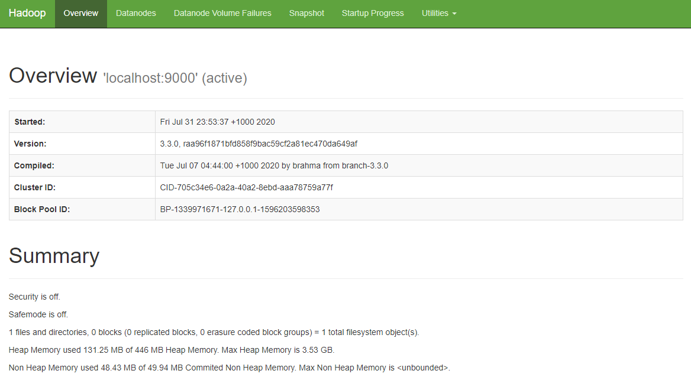
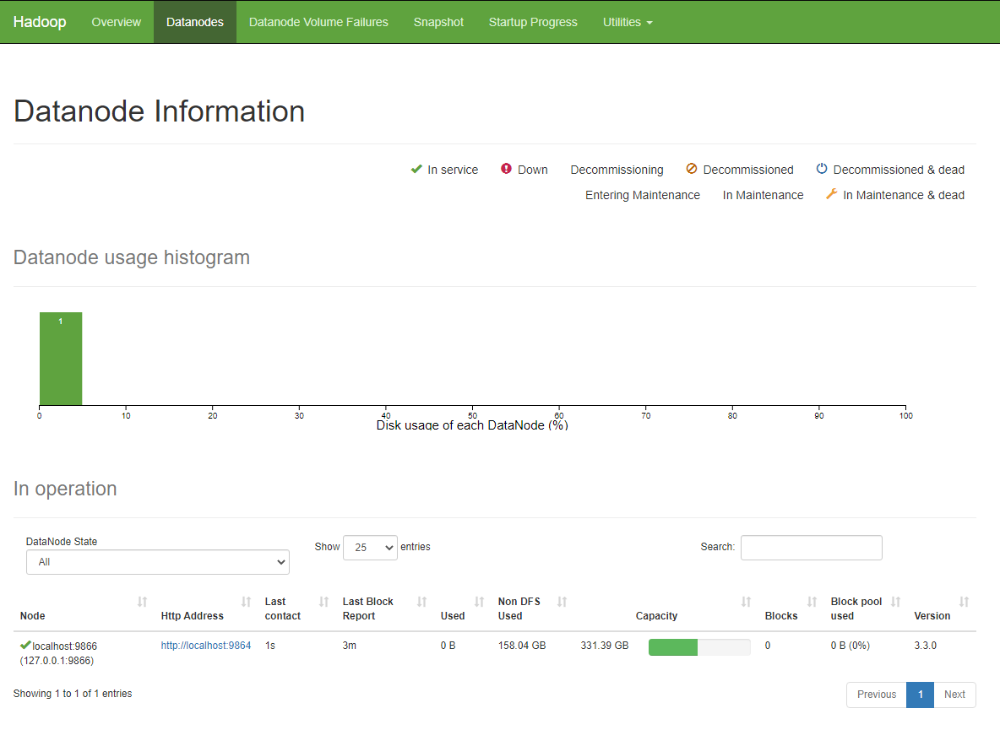
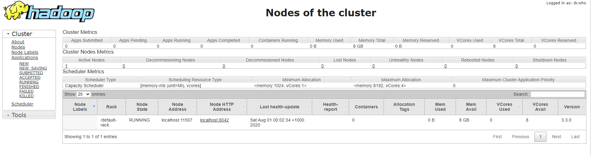

# 🔧 Installation

## Source



## First Thing First 😜

#### Make Main Directory <a href="#unzip_hadoop_binary_2" id="unzip_hadoop_binary_2"></a>


This preparation make main directory is optional, It's up to you to put the directory anywhere.


Run the following command to create a **main** folder :

> ```
> mkdir /usr/local/apache/
> chmod 777 /usr/local/apache/
> ```

## Java

### Install Java JDK

Run the following command to update package index :

> ```
> sudo apt update
> ```

Check whether Java is installed already :

> ```
> java -version
> ```
>
> Command 'java' not found, but can be installed with :
>
> ```
> sudo apt install default-jre
> sudo apt install openjdk-11-jre-headless
> sudo apt install openjdk-8-jre-headless
> ```

Install OpenJDK via the following command :

> ```
> sudo apt-get install openjdk-8-jdk
> ```

Check the version installed :

> ```
> java -version
> openjdk version "1.8.0_191"
> OpenJDK Runtime Environment (build 1.8.0_191-8u191-b12-2ubuntu0.18.04.1-b12)
> OpenJDK 64-Bit Server VM (build 25.191-b12, mixed mode)
> ```


**Note :** All configuration will use in Java 8 version. Please set java 8  as default java version on your operating system.


### Checking Java versions installed on Ubuntu / Debian

To get a list of installed Java versions, run the command :

```bash
$ update-java-alternatives --list
 java-1.11.0-openjdk-amd64      1101       /usr/lib/jvm/java-1.11.0-openjdk-amd64
 java-8-oracle                  1081       /usr/lib/jvm/java-8-oracle
```

Once you have a list of Java version, set a default one by running the command :

```bash
$ sudo update-alternatives --config java
There are 2 choices for the alternative java (providing /usr/bin/java).
Selection    Path                                         Priority   Status
0            /usr/lib/jvm/java-11-openjdk-amd64/bin/java   1101      auto mode
1            /usr/lib/jvm/java-11-openjdk-amd64/bin/java   1101      manual mode
2            /usr/lib/jvm/java-8-oracle/jre/bin/java       1081      manual mode
Press to keep the current choice[*], or type selection number: 2
```

Check Java version :

```
$ java -version
 java version "1.8.0_191"
 Java(TM) SE Runtime Environment (build 1.8.0_191-b12)
 Java HotSpot(TM) 64-Bit Server VM (build 25.191-b12, mixed mode)
```

## Hadoop

### Download Hadoop binary

In this tutorial using **hadoop version 3.3.1**

```bash
wget http://mirror.intergrid.com.au/apache/hadoop/common/hadoop-3.3.1/hadoop-3.3.1.tar.gz
```

### Unzip Hadoop binary

Run the following command to create a **hadoop** folder under user home folder :

> ```
> mkdir /usr/local/apache/hadoop-3.3.1
> ```

And then run the following command to unzip the binary package :

> ```
> tar -xvzf hadoop-3.3.1.tar.gz -C /usr/local/apache/hadoop-3.3.1 --strip 1
> ```

Change the access permissions of file system objects in the **hadoop** folder :

> ```
> chmod 777 /usr/local/apache/hadoop-3.3.1/*
> ```

Once it is unpacked, change the current directory to the **hadoop** folder :

> ```
> cd /usr/local/apache/hadoop-3.3.1
> ```

## Configure the pseudo-distributed mode (Single-node mode)

Now, we can follow the official guide to configure a single node:

> [Pseudo-Distributed Operation](https://hadoop.apache.org/docs/r3.3.1/hadoop-project-dist/hadoop-common/SingleCluster.html#Pseudo-Distributed\_OperationPseudo-Distributed\_Operation)

### 1 . Setup environment variables (optional)

Setup environment variables by editing file **\~/.bashrc** :

```
 nano ~/.bashrc
```

Add the following environment variables :

```
# Configure Java 
# (java will set on version 8 because mostly program running on this version)
export JAVA_HOME=/usr/lib/jvm/java-1.8.0-openjdk-amd64
export PATH=$PATH:$JAVA_HOME/bin

# Configure Hadoop
export HADOOP_HOME=/usr/local/apache/hadoop-3.3.1
export PATH=$PATH:$HADOOP_HOME/bin
export HADOOP_CONF_DIR=$HADOOP_HOME/etc/hadoop
```

Run the following command to source the latest variables :

```bash
source ~/.bashrc
```

### 2. Edit Hadoop Env File

Location to edit this file in : **`$HADOOP_HOME/etc/hadoop/hadoop-env.sh`**

> ```
> nano etc/hadoop/hadoop-env.sh
> ```

Set a **JAVA\_HOME** environment variable:

> ```
> export JAVA_HOME=/usr/lib/jvm/java-1.8.0-openjdk-amd64
> ```

### 3. Edit Core XML File :

Location to edit this file in : **`$HADOOP_HOME/etc/hadoop/core-site.xml`**

> ```
> nano etc/hadoop/core-site.xml
> ```

Add the following configuration , please replace the **\[username]** with user name to your **own user name** without this **( \[ ] )** :

> ```
> <configuration>
>      <property>
>           <name>fs.defaultFS</name>
>           <value>hdfs://localhost:9000</value>
>      </property>
>       <property>
>           <name>hadoop.proxyuser.[username].hosts</name>
>           <value>*</value>
>       </property>
>       <property>
>           <name>hadoop.proxyuser.[username].groups</name>
>           <value>*</value>
>       </property>
> </configuration>
> ```

### 4. Edit HDFS XML F**ile**

Location to edit this file in : **`$HADOOP_HOME/etc/hadoop/hdfs-site.xml`**

> ```
> nano etc/hadoop/hdfs-site.xml
> ```

Add the following configuration:

> ```
> <configuration>
>      <property>
>          <name>dfs.replication</name>
>          <value>1</value>
>      </property>
>      <property>
>          <name>dfs.client.datanode-restart.timeout</name>
>          <value>30</value>
>      </property>
> </configuration>
> ```

### 5. Edit Map Reducer XML F**ile**

Location to edit this file in : **`$HADOOP_HOME/etc/hadoop/mapred-site.xml`**

> ```
> nano etc/hadoop/mapred-site.xml
> ```

Add the following configuration:

> ```
> <configuration>
>      <property>
>          <name>mapreduce.framework.name</name>
>          <value>yarn</value>
>      </property>
>      <property>
>          <name>mapreduce.application.classpath</name>
>          <value>$HADOOP_MAPRED_HOME/share/hadoop/mapreduce/*:$HADOOP_MAPRED_HOME/share/hadoop/mapreduce/lib/*</value>
>      </property>
>      <property>
>          <name>mapred.map.tasks.speculative.execution</name>
>          <value>true</value>
>      </property>
>      <property>
>          <name>mapred.reduce.tasks.speculative.execution</name>
>          <value>true</value>
>      </property>
> </configuration>
> ```

### 6. Edit Yarn XML F**ile**

Location to edit this file in : **`$HADOOP_HOME/etc/hadoop/yarn-site.xml`**

> ```
> nano etc/hadoop/yarn-site.xml
> ```

Add the following configuration:

> ```
> <configuration>
>     <property>
>         <name>yarn.nodemanager.aux-services</name>
>         <value>mapreduce_shuffle</value>
>     </property>
>     <property>
>         <name>yarn.nodemanager.env-whitelist</name>
>         <value>JAVA_HOME,HADOOP_COMMON_HOME,HADOOP_HDFS_HOME,HADOOP_CONF_DIR,CLASSPATH_PREPEND_DISTCACHE,HADOOP_YARN_HOME,HADOOP_MAPRED_HOME</value>
>     </property>
>     <property>
>         <name>yarn.application.classpath</name>
>         <value>$HADOOP_HOME/share/hadoop/mapreduce/*,$HADOOP_HOME/share/hadoop/mapreduce/lib/*,$HADOOP_HOME/share/hadoop/hdfs/*,$HADOOP_HOME/share/hadoop/hdfs/lib/*,$HADOOP_HOME/share/hadoop/common/lib/*,$HADOOP_HOME/share/hadoop/common/*,$HADOOP_HOME/share/hadoop/yarn/lib/*,$HADOOP_HOME/share/hadoop/yarn/*</value>
>     </property>
>     <property>
>         <name>mapreduce.application.classpath</name>
>         <value>$HADOOP_HOME/share/hadoop/mapreduce/*,$HADOOP_HOME/share/hadoop/mapreduce/lib/*,$HADOOP_HOME/share/hadoop/hdfs/*,$HADOOP_HOME/share/hadoop/hdfs/lib/*,$HADOOP_HOME/share/hadoop/common/lib/*,$HADOOP_HOME/share/hadoop/common/*,$HADOOP_HOME/share/hadoop/yarn/lib/*,$HADOOP_HOME/share/hadoop/yarn/*</value>
>     </property>
> </configuration>
> ```

## Format HDFS Namenode

Run the following command to format the name node:

> ```
> hdfs namenode -format
> ```

## Run DFS daemons

### 1. Run the following commands to start Namenode and Datanode daemons:

> ```
> testuser@test-pc:/usr/local/apache/hadoop-3.3.1$ sbin/start-dfs.sh
> Starting namenodes on [localhost]
> Starting datanodes
> Starting secondary namenodes [test-pc]
> ```

### 2. Check status via **jps** command:

```
testuser@test-pc:/usr/local/apache/hadoop-3.3.1$ jps
2212 NameNode
2423 DataNode
2682 SecondaryNameNode
2829 Jps
```

When the services are initiated successfully, you should be able to see these four processes.

### 3. View Namenode Portal

You can view the name node through the following URL :

> [http://localhost:9870/dfshealth.html#tab-overview](http://localhost:9870/dfshealth.html#tab-overview)

The web UI looks like the following :



&#x20;You can also view the data nodes information through menu link **Datanodes**:



## Run YARN daemon

### 1. Run the following command to start YARN daemon:

> ```
> $HADOOP_HOME/sbin/start-yarn.sh
> ```

> ```
> testuser@test-pc:/usr/local/apache/hadoop-3.3.1$ sbin/start-yarn.sh
> Starting resourcemanager
> Starting nodemanagers
> ```

### 2. Check status via **jps** command

```
testuser@test-pc:/usr/local/apache/hadoop-3.3.1$ jps
2212 NameNode
5189 NodeManager
2423 DataNode
5560 Jps
5001 ResourceManager
2682 SecondaryNameNode
```

Once the services are started, you can see two more processes for **NodeManager** and **ResourceManager**.

### 3. View YARN web portal

You can view the YARN resource manager web UI through the following URL:

> [http://localhost:8088/cluster](http://localhost:8088/cluster)

The web UI looks like the following:



You can view all the applications through this web portal.&#x20;

## Shutdown Services

Once you've completed explorations, you can use the following **command to shutdown** those daemons:

```
$HADOOP_HOME/sbin/stop-yarn.sh
$HADOOP_HOME/sbin/stop-dfs.sh
```

You can verify through **jps** command which will only show one process now:

```
testuser@test-pc:/usr/local/apache/hadoop-3.3.1$ jps
6593 Jps
```

## Summary

Congratulations! Now you have successfully installed a single node Hadoop 3.3.0 cluster in your Linux.
