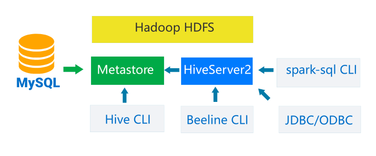
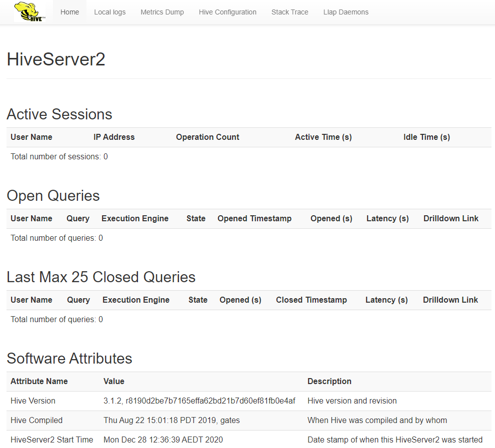

# 🔧 Installation

## Source





## Introduction

On this session I'm going to show you to install the latest version Apache Hive 3.1.2 on Linux Ubuntu distro. You can follow these instructions to install Apache Hive 3.1.2 on any UNIX-alike systems incl. Debian, Ubuntu, openSUSE, Red Hat, etc. We will also include step of configuring MySQL as remote metastore for Hive to support concurrent requests.



## First Thing First 😜

#### Make Main Directory <a href="#unzip_hadoop_binary_2" id="unzip_hadoop_binary_2"></a>


This preparation make main directory is optional, It's up to you to put the directory anywhere.


Run the following command to create a **main** folder :

> ```
> mkdir /usr/local/apache/
> chmod 777 /usr/local/apache/
> ```

### Prerequisites

You need install and setup this :

* Linux OS ( Ubuntu / Debian / etc )
* (**Mandatory**) Install Hadoop 3.3.1 on your linux system&#x20;

## Hive

### Download Hive binary

Select a package from the download page :



For me, the recommended location is:&#x20;

```
wget https://www.strategylions.com.au/mirror/hive/hive-3.1.2/apache-hive-3.1.2-bin.tar.gz
```

### Unzip Hive binary

Run the following command to create a **hive** folder under user home folder :

> ```
> mkdir /usr/local/apache/hive-3.1.2
> ```

And then run the following command to unzip the binary package :

> ```
> tar -xvzf apache-hive-3.1.2-bin.tar.gz -C /usr/local/apache/hive-3.1.2 --strip 1
> ```

Change the access permissions of file system objects in the **hive** folder :

> ```
> chmod 777 /usr/local/apache/hive-3.1.2/*
> ```

Once it is unpacked, change the current directory to the **hive** folder :

> ```
> cd /usr/local/apache/hive-3.1.2
> ```

### Setup environment variables (optional)

Let’s run the following command to add Hive required environment variables into **.bashrc** file too:

> ```
> nano ~/.bashrc
> ```

Add the following lines to the end of the file:

> ```
> # Configure Hive
> export HIVE_HOME=/usr/local/apache/hive-3.1.2
> export PATH=$PATH:$HIVE_HOME/bin
> ```

Run the following command to source the variables:

> ```
> source ~/.bashrc
> ```

## Setup Hive HDFS folders

Use the following **command to start hadoop** daemons :

```
$HADOOP_HOME/sbin/start-yarn.sh
$HADOOP_HOME/sbin/start-dfs.sh
```

You can verify through **jps** command which will only show one process now :

```
testuser@test-pc:/usr/local/apache/hadoop-3.3.1$ jps
2212 NameNode
5189 NodeManager
2423 DataNode
5560 Jps
5001 ResourceManager
2682 SecondaryNameNode
```

As you can see, all the services are running successfully.

Now let’s setup the **HDFS folders** for **Hive**.

Run the following commands:

> ```
> hadoop fs -mkdir /tmp
> hadoop fs -mkdir -p /user/hive/warehouse
> hadoop fs -chmod g+w /tmp
> hadoop fs -chmod g+w /user/hive/warehouse
> ```

## Guava Lib Issue

To avoid issues like the one described on page:&#x20;

[Hive: Exception in thread "main" java.lang.NoSuchMethodError: com.google.common.base.Preconditions.checkArgument(ZLjava/lang/String;Ljava/lang/Object;)V](https://kontext.tech/column/hadoop/415/hive-exception-in-thread-main-javalangnosuchmethoderror-comgooglecommon),&#x20;

let's ensure guava library version is consistent between Hive and Hadoop.

*   Hadoop 3.3.1 :

    ```
    $ ls $HADOOP_HOME/share/hadoop/common/lib | grep guava
    guava-27.0-jre.jar
    ```
*   Hive 3.1.2 :

    ```
    $ ls $HIVE_HOME/lib | grep guava
    guava-19.0.jar
    jersey-guava-2.25.1.jar
    ```
*   Copy newer version from Hadoop to Hive :

    ```
    rm $HIVE_HOME/lib/guava-19.0.jar
    cp $HADOOP_HOME/share/hadoop/common/lib/guava-27.0-jre.jar $HIVE_HOME/lib/
    ```

## Setup MySQL Server

For Debian :&#x20;



For Ubuntu :



Make sure you can enter mysql CLI (sudo mysql):

```
$ sudo mysql
Welcome to the MySQL monitor.  Commands end with ; or \g.
Your MySQL connection id is 4
Server version: 8.0.25-0ubuntu0.20.04.1 (Ubuntu)

Copyright (c) 2000, 2021, Oracle and/or its affiliates. All rights reserved.

Oracle is a registered trademark of Oracle Corporation and/or its
affiliates. Other names may be trademarks of their respective
owners.

Type 'help;' or '\h' for help. Type '\c' to clear the current input statement.

mysql>
```

#### Create Hive metastore database and user

Run the following commands in mysql CLI:

```
sudo mysql
mysql> CREATE USER 'hive'@'localhost' IDENTIFIED BY 'hive' password expire never;
mysql> GRANT ALL ON *.* TO 'hive'@'localhost';
mysql> exit;
mysql -u hive -phive
mysql> create database hive_metastore;
Query OK, 1 row affected (0.00 sec)
mysql> show databases;
+--------------------+
| Database           |
+--------------------+
| information_schema |
| hive_metastore     |
| mysql              |
| performance_schema |
| sys                |
+--------------------+
5 rows in set (0.00 sec)
```

After these steps, the following database objects are created:

* user: **hive**
* password: **hive**
* database: **hive\_metastore**

These details are required in the following steps to create **Hive metastore**.&#x20;


MySQL database server needs to be running before every time you can start your Hive metastore and HiveServer2 services.


#### Configure Hive metastore <a href="#configure_hive_metastore_7" id="configure_hive_metastore_7"></a>

Follow these steps to configure a remote Hive metastore. These steps are similar as the SQL Server configuration guide: [Configure a SQL Server Database as Remote Hive Metastore](https://kontext.tech/column/hadoop/302/configure-a-sql-server-database-as-remote-hive-metastore).

**Download MySQL JDBC driver**

First let's find out MySQL version to download the compatible JDBC driver:

```
mysql --version
mysql Ver 8.0.25-0ubuntu0.20.04.1 for Linux x86_64 ((Ubuntu))
```

Download MySQL JDBC driver from official website [MySQL :: Download Connector/J](https://dev.mysql.com/downloads/connector/j/) and choose the right version for your Linux system.

Alternatively, we can directly download it from [Maven central](https://mvnrepository.com/artifact/mysql/mysql-connector-java).&#x20;

For my **linux system**, I am using the following version **(8.0.25)**:

```
wget https://repo1.maven.org/maven2/mysql/mysql-connector-java/8.0.25/mysql-connector-java-8.0.25.jar
```

Move the **downloaded JAR** file to **Hive lib** folder:

```
mv mysql-connector-java-8.0.25.jar $HIVE_HOME/lib/
```

## **Configure Hive file `hive-site.xml`**

Edit hive-default.xml file (or create one if not existing) in folder $HIVE\_HOME/conf.

\* You can **create** the **configuration** file by **using** template file **hive-default.xml.template**.

> ```
> cp $HIVE_HOME/conf/hive-default.xml.template $HIVE_HOME/conf/hive-site.xml
> ```

The above command needs to run in Cygwin terminal.

We need configure the following properties accordingly :

*   javax.jdo.option.ConnectionDriverName: **com.mysql.jdbc.Driver** or **com.mysql.cj.jdbc.Driver**

    &#x20;depends on the version of your MySQL JDBC driver.
* javax.jdo.option.ConnectionURL: **jdbc:mysql://localhost/hive\_metastore**
* javax.jdo.option.ConnectionUserName: **hive**
* javax.jdo.option.ConnectionPassword: **hive**
* hive.metastore.uris: **thrift://127.0.0.1:9083**
* hive.metastore.db.type:  **mysql**


For MySQL JDBC driver version 8.0.25, the driver class name is **com.mysql.cj.jdbc.Driver** not ~~**com.mysql.jdbc.Driver**~~


The highlighted values are from our configurations in MySQL Server installation step.

For my environment (search **property name** in file **hive-site.xml** following with configuration in bellow), these items are configured as the following :

```
...
<property>
   <name>javax.jdo.option.ConnectionDriverName</name>
   <value>com.mysql.cj.jdbc.Driver</value>
   <description>Driver class name for a JDBC metastore</description>
</property>
<property>
   <name>javax.jdo.option.ConnectionURL</name>
   <value>jdbc:mysql://localhost/hive_metastore</value>
   <description>
     JDBC connect string for a JDBC metastore.
     To use SSL to encrypt/authenticate the connection, provide database-specific SSL flag in the connection URL.
     For example, jdbc:postgresql://myhost/db?ssl=true for postgres database.
   </description>
</property>
<property>
    <name>javax.jdo.option.ConnectionUserName</name>
    <value>hive</value>
    <description>Username to use against metastore database</description>
  </property>
<property>
   <name>javax.jdo.option.ConnectionPassword</name>
   <value>hive</value>
   <description>password to use against metastore database</description>
</property>
<property>
   <name>hive.metastore.uris</name>
   <value>thrift://127.0.0.1:9083</value>
   <description>Thrift URI for the remote metastore. Used by metastore client to connect to remote metastore.</description>
</property>
<property>
   <name>hive.metastore.db.type</name>
   <value>mysql</value>
   <description>
     Expects one of [derby, oracle, mysql, mssql, postgres].
     Type of database used by the metastore. Information schema &amp; JDBCStorageHandler depend on it.
   </description>
</property>
...
```


**lf your MySQL is not running on the default port**, please update the JDBC connection string accordingly. **For example**, 'jdbc:mysql://**localhost:10101**/hive\_metastore?serverTimezone=UTC' **specifies the port as 10101** on the same server.


## **Initialize database structure**

Now we need to run schema tool to setup meta store for Hive. The command syntax looks like the following :

> ```
> $HIVE_HOME/bin/schematool -dbType <db type> -initSchema
> ```

For argument **dbType**, it can be any of the following values:

> ```
> derby|mysql|postgres|oracle|mssql
> ```

By default, Apache Derby will be used. However it is a standalone database and can only be used for one connection concurrently.

Let's now run the following command in Bash to initiate database schema:

```
$HIVE_HOME/bin/schematool -dbType mysql -initSchema
```

When I was initializing the schema on WSL system, I got the following error:

```
Metastore connection URL:        jdbc:mysql://localhost/hive_metastore
Metastore Connection Driver :    com.mysql.cj.jdbc.Driver
Metastore connection User:       hive
org.apache.hadoop.hive.metastore.HiveMetaException: Failed to get schema version.
Underlying cause: java.sql.SQLException : The server time zone value 'AEDT' is unrecognized or represents more than one time zone. You must configure either the server or JDBC driver (via the 'serverTimezone' configuration property) to use a more specific time zone value if you want to utilize time zone support.
SQL Error code: 0
Use --verbose for detailed stacktrace.
*** schemaTool failed ***
```

This is a new error I didn't encounter before when configuring SQL Server database as Hive metastore.

To fix this issue, refer to [MySQL: The server time zone value 'AEDT' is unrecognized or represents more than one time zone](https://kontext.tech/column/sql-databases/566/mysql-the-server-time-zone-value-aedt-is-unrecognized-or-represents-more-than-one-time-zone). We just need to update JDBC connection string accordingly:

```
<property>
    <name>javax.jdo.option.ConnectionURL</name>
    <value>jdbc:mysql://localhost/hive_metastore?serverTimezone=UTC</value>
    <description>
      JDBC connect string for a JDBC metastore.
      To use SSL to encrypt/authenticate the connection, provide database-specific SSL flag in the connection URL.
      For example, jdbc:postgresql://myhost/db?ssl=true for postgres database.
    </description>
</property>
```

Once the command line completes, you should be able to see the successful messages at the end:

```
...

Initialization script completed
schemaTool completed
```

### **Verify the schema in MySql CLI**

Double confirm the schema using MySql CLI:

```
mysql> use hive_metastore;
Reading table information for completion of table and column names
You can turn off this feature to get a quicker startup with -A

Database changed
mysql> show tables;
+-------------------------------+
| Tables_in_hive_metastore      |
+-------------------------------+
| AUX_TABLE                     |
| BUCKETING_COLS                |
| CDS                           |
| COLUMNS_V2                    |
| COMPACTION_QUEUE              |
| COMPLETED_COMPACTIONS         |
| COMPLETED_TXN_COMPONENTS      |
| CTLGS                         |
| DATABASE_PARAMS               |
| DBS                           |
| DB_PRIVS                      |
| DELEGATION_TOKENS             |
| FUNCS                         |
| FUNC_RU                       |
| GLOBAL_PRIVS                  |
| HIVE_LOCKS                    |
| IDXS                          |
| INDEX_PARAMS                  |
| I_SCHEMA                      |
| KEY_CONSTRAINTS               |
| MASTER_KEYS                   |
| MATERIALIZATION_REBUILD_LOCKS |
| METASTORE_DB_PROPERTIES       |
| MIN_HISTORY_LEVEL             |
| MV_CREATION_METADATA          |
| MV_TABLES_USED                |
| NEXT_COMPACTION_QUEUE_ID      |
| NEXT_LOCK_ID                  |
| NEXT_TXN_ID                   |
| NEXT_WRITE_ID                 |
| NOTIFICATION_LOG              |
| NOTIFICATION_SEQUENCE         |
| NUCLEUS_TABLES                |
| PARTITIONS                    |
| PARTITION_EVENTS              |
| PARTITION_KEYS                |
| PARTITION_KEY_VALS            |
| PARTITION_PARAMS              |
| PART_COL_PRIVS                |
| PART_COL_STATS                |
| PART_PRIVS                    |
| REPL_TXN_MAP                  |
| ROLES                         |
| ROLE_MAP                      |
| RUNTIME_STATS                 |
| SCHEMA_VERSION                |
| SDS                           |
| SD_PARAMS                     |
| SEQUENCE_TABLE                |
| SERDES                        |
| SERDE_PARAMS                  |
| SKEWED_COL_NAMES              |
| SKEWED_COL_VALUE_LOC_MAP      |
| SKEWED_STRING_LIST            |
| SKEWED_STRING_LIST_VALUES     |
| SKEWED_VALUES                 |
| SORT_COLS                     |
| TABLE_PARAMS                  |
| TAB_COL_STATS                 |
| TBLS                          |
| TBL_COL_PRIVS                 |
| TBL_PRIVS                     |
| TXNS                          |
| TXN_COMPONENTS                |
| TXN_TO_WRITE_ID               |
| TYPES                         |
| TYPE_FIELDS                   |
| VERSION                       |
| WM_MAPPING                    |
| WM_POOL                       |
| WM_POOL_TO_TRIGGER            |
| WM_RESOURCEPLAN               |
| WM_TRIGGER                    |
| WRITE_SET                     |
+-------------------------------+
74 rows in set (0.00 sec)

mysql>
```

All these tables in **Hive metastore** schema are created successfully.&#x20;

### Configure Hive API authentication

Add the following section to **$HIVE\_HOME/conf/hive-site.xml** file:

> ```
> <property>
>    <name>hive.metastore.event.db.notification.api.auth</name>
>    <value>false</value>
>    <description>
>      Should metastore do authorization against database notification related APIs such as get_next_notification.
>      If set to true, then only the superusers in proxy settings have the permission
>    </description>
> </property>
> ```

And then update **$HADOOP\_HOME/etc/hadoop/core-site.xml** configuration file to add the following configurations:

> ```
> <property>
>       <name>hadoop.proxyuser.[username].hosts</name>
>       <value>*</value>
> </property>
> <property>
>       <name>hadoop.proxyuser.[username].groups</name>
>       <value>*</value>
> </property>
> ```

\* Replace the **\[username]** with user name to your **own user name** without this **( \[ ] )**.&#x20;

### Config a tmpdir for Java and Add Property Username

Add this custom configuration, on top configuration in **`$HIVE_HOME/conf/hive-site.xml`** :

```
<property>
    <name>system:java.io.tmpdir</name>
    <value>/usr/local/apache/hive-3.1.2/tmp/java</value>
</property>
<property>
    <name>system:user.name</name>
    <value>${user.name}</value>
</property>
```


**Make sure Hadoop services are running** before kicking off Hive services.



**Now all the configurations are done** and we are ready to **start Hive services**.


## Start M**etastore And** HiveServer2 Service

Run the command below to start the HiveServer2 service with nohup :

> ```
> nohup $HIVE_HOME/bin/hive --service metastore &
> nohup $HIVE_HOME/bin/hive --service hiveserver2 &
> ```

Wait until you can open HiveServer2 Web UI:  [http://localhost:10002/](http://localhost:10002/).



## Stop M**etastore And** HiveServer2 Service

To show service, following command in bellow :

> ```
> jps
> ```

.png>)

alternative you can use **ps aux** to show all program service, following command in bellow :

> ```
> ps aux
> ```

Kill service with PID number, following command in bellow :

> ```
> kill -9 <PID>
> ```

Example :

> ```
> kill -9 1061; kill -9 758
> ```

### Summary

Congratulations! Now you have successfully installed a hive and setup with hadoop in your Linux.
