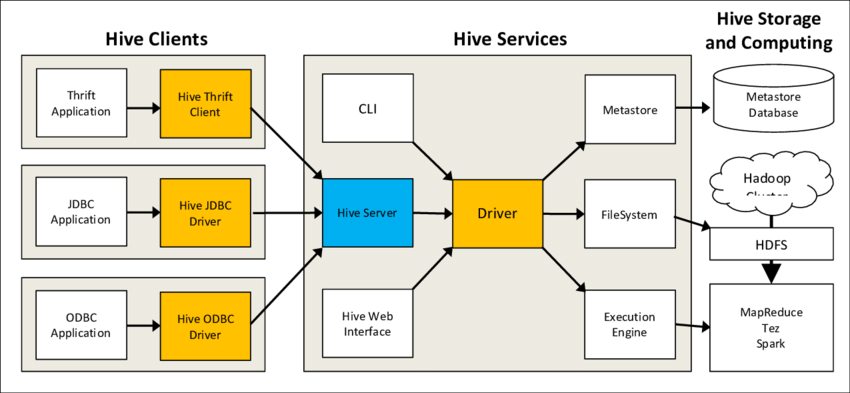

# 🤓 What is Hive?

## 👀 Introduction

Hive is a data warehouse infrastructure tool to process structured data in Hadoop. It resides on top of Hadoop to summarize Big Data, and makes querying and analyzing easy.

Initially Hive was developed by Facebook, later the Apache Software Foundation took it up and developed it further as an open source under the name Apache Hive. It is used by different companies. For example, Amazon uses it in Amazon Elastic MapReduce.

#### Hadoop

Hadoop is an open-source framework to store and process Big Data in a distributed environment. It contains two modules, one is MapReduce and another is Hadoop Distributed File System (HDFS).

* **MapReduce:** It is a parallel programming model for processing large amounts of structured, semi-structured, and unstructured data on large clusters of commodity hardware.
* **HDFS:**Hadoop Distributed File System is a part of Hadoop framework, used to store and process the datasets. It provides a fault-tolerant file system to run on commodity hardware.

The Hadoop ecosystem contains different sub-projects (tools) such as Sqoop, Pig, and Hive that are used to help Hadoop modules.

* **Sqoop:** It is used to import and export data to and from between HDFS and RDBMS.
* **Pig:** It is a procedural language platform used to develop a script for MapReduce operations.
* **Hive:** It is a platform used to develop SQL type scripts to do MapReduce operations.

**Note:** There are various ways to execute MapReduce operations:

* The traditional approach using Java MapReduce program for structured, semi-structured, and unstructured data.
* The scripting approach for MapReduce to process structured and semi structured data using Pig.
* The Hive Query Language (HiveQL or HQL) for MapReduce to process structured data using Hive.

#### Hive is not :

* A relational database
* A design for OnLine Transaction Processing (OLTP)
* A language for real-time queries and row-level updates

### Features of Hive

* It stores schema in a database and processed data into HDFS.
* It is designed for OLAP.
* It provides SQL type language for querying called HiveQL or HQL.
* It is familiar, fast, scalable, and extensible.

### Architecture of Hive

The following component diagram depicts the architecture of Hive :

This component diagram contains different units. The following table describes each unit:

|       **Unit Name**       |  **Operation**                                                                                                                                                                                                                                           |
| :-----------------------: | -------------------------------------------------------------------------------------------------------------------------------------------------------------------------------------------------------------------------------------------------------- |
|     **User Interface**    | Hive is a data warehouse infrastructure software that can create interaction between user and HDFS. The user interfaces that Hive supports are Hive Web UI, Hive command line, and Hive HD Insight (In Windows server).                                  |
|       **Meta Store**      | Hive chooses respective database servers to store the schema or Metadata of tables, databases, columns in a table, their data types, and HDFS mapping.                                                                                                   |
| **HiveQL Process Engine** | HiveQL is similar to SQL for querying on schema info on the Metastore. It is one of the replacements of traditional approach for MapReduce program. Instead of writing MapReduce program in Java, we can write a query for MapReduce job and process it. |
|    **Execution Engine**   | The conjunction part of HiveQL process Engine and MapReduce is Hive Execution Engine. Execution engine processes the query and generates results as same as MapReduce results. It uses the flavor of MapReduce.                                          |
|     **HDFS or HBASE**     | Hadoop distributed file system or HBASE are the data storage techniques to store data into file system.                                                                                                                                                  |

### Working of Hive

The following diagram depicts the workflow between Hive and Hadoop.

The following table defines how Hive interacts with Hadoop framework:

| No. | Operation                                                                                                                                                                                                                                                                             |
| :-: | ------------------------------------------------------------------------------------------------------------------------------------------------------------------------------------------------------------------------------------------------------------------------------------- |
|  1  | 
<strong>Execute Query</strong>

The Hive interface such as Command Line or Web UI sends query to Driver (any database driver such as JDBC, ODBC, etc.) to execute.
                                                                                                        |
|  2  | 
<strong>Get Plan</strong>

The driver takes the help of query compiler that parses the query to check the syntax and query plan or the requirement of query.
                                                                                                              |
|  3  | 
<strong>Get Metadata</strong>

The compiler sends metadata request to Metastore (any database).
                                                                                                                                                                           |
|  4  | 
<strong>Send Metadata</strong>

Metastore sends metadata as a response to the compiler.
                                                                                                                                                                                   |
|  5  | 
<strong>Send Plan</strong>

The compiler checks the requirement and resends the plan to the driver. Up to here, the parsing and compiling of a query is complete.
                                                                                                         |
|  6  | 
<strong>Execute Plan</strong>

The driver sends the execute plan to the execution engine.
                                                                                                                                                                                 |
|  7  | 
<strong>Execute Job</strong>

Internally, the process of execution job is a MapReduce job. The execution engine sends the job to JobTracker, which is in Name node and it assigns this job to TaskTracker, which is in Data node. Here, the query executes MapReduce job.
 |
| 7.1 | 
<strong>Metadata Ops</strong>

Meanwhile in execution, the execution engine can execute metadata operations with Metastore.
                                                                                                                                               |
|  8  | 
<strong>Fetch Result</strong>

The execution engine receives the results from Data nodes.
                                                                                                                                                                                 |
|  9  | 
<strong>Send Results</strong>

The execution engine sends those resultant values to the driver.
                                                                                                                                                                           |
|  10 | 
<strong>Send Results</strong>

The driver sends the results to Hive Interfaces.
                                                                                                                                                                                           |


Read more articles :

* [Tutorialspoint - Hive Introduction](https://www.tutorialspoint.com/hive/hive\_introduction.htm)

