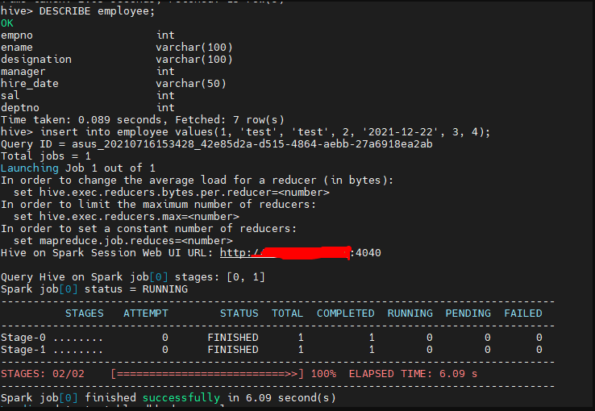

# 🔧 Installation

### Source :







## Introduction

On this session I'm going to show you to install the Apache Spark 2.3.0 version on Linux Ubuntu distro. You can follow these instructions to install Apache Spark 2.3.0 on any UNIX-alike systems incl. Debian, Ubuntu, openSUSE, Red Hat, etc. We will also include step of configuring MySQL as remote meta store for Hive to support concurrent requests.

## GOAL

This goal is make a **spark as execution engine for hive**. Default **execution engine for Hive is MapReduce**. **MapReduce runs slower** usually. **Spark is better faster engine** for running queries on Hive.

It’s important to make sure that **Spark and Hive versions** are **compatible with each other**. Follow hive and spark version compatibility from link below :

{% embed url="https://cwiki.apache.org/confluence/display/Hive/Hive+on+Spark%3A+Getting+Started" %}

Determine **Hive and Spark versions** to install using link above.

## First Thing First 😜

#### Make Main Directory <a href="#unzip_hadoop_binary_2" id="unzip_hadoop_binary_2"></a>


This preparation make main directory is optional, It's up to you to put the directory anywhere.


Run the following command to create a **main** folder :

> ```
> mkdir /usr/local/apache/
> chmod 777 /usr/local/apache/
> ```

### Prerequisites

You need install and setup this :

* Linux OS ( Ubuntu / Debian / etc )
* (**Mandatory**) Install Hadoop 3.3.1 on your linux system&#x20;
* (**Mandatory**) Install Hive 3.1.2 on your linux system

## Spark

### Download binary package

Well, because for Spark 2.3.0 version is **already archive** you can download following link in bellow :



Download the binary package using the following command (remember to replace the URL with your closest download site) :

> ```
> wget https://archive.apache.org/dist/spark/spark-2.3.0/spark-2.3.0-bin-hadoop2.7.tgz
> ```

Wait until the download is completed.

### Unpack the binary package

Unpack the package using the following command :

> ```
> mkdir /usr/local/apache/spark-2.3.0
> tar -xvzf spark-2.3.0-bin-hadoop2.7.tgz -C /usr/local/apache/spark-2.3.0 --strip 1
> chmod 777 /usr/local/apache/spark-2.3.0/*
> ```

The Spark binaries are unzipped to folder **/usr/local/apache/spark-2.3.0**

### Setup environment variables

Setup **SPARK\_HOME** environment variables and also add the bin subfolder into **PATH** variable. We also need to configure Spark environment variable **SPARK\_DIST\_CLASSPATH** to use Hadoop Java class path.&#x20;

Run the following command to change **.bashrc** file :

> ```
> nano ~/.bashrc
> ```

Add the following lines to the end of the file :

> ```
> export SPARK_HOME=/usr/local/apache/spark-2.3.0                                
> export PATH=$PATH:$SPARK_HOME/bin
> export SPARK_MASTER_HOST=localhost
> export SPARK_MASTER_PORT=7077
> export SPARK_MASTER_WEBUI_PORT=7180
> ```

Source the modified file to make it effective :

```
source ~/.bashrc
```

## Setup Hive configurations

### Edit Hive XML File

Dont forget to make directory spark event logs dir :

```
mkdir /usr/local/apache/tmp
mkdir /usr/local/apache/tmp/spark
mkdir /usr/local/apache/tmp/spark/event-logs
chmod -R 777 /usr/local/apache/tmp
```

Add a this custom configuration on **`$HIVE_HOME/conf/hive-site.xml`** :

```
...
  <property>
    <name>spark.master</name>
    <value>spark://localhost:7077</value>
  </property>
  <property>
    <name>spark.eventLog.enabled</name>
    <value>true</value>
  </property>
  <!-- you can put this on hdfs : hdfs://localhost:9000/spark-logs -->
  <property>
    <name>spark.eventLog.dir</name>
    <value>/usr/local/apache/tmp/spark/event-logs</value>
  </property>
  <property>
    <name>spark.serializer</name>
    <value>org.apache.spark.serializer.KryoSerializer</value>
  </property>
  <!-- you can custom this driver memory following your memory on your machine -->
  <!-- default : 512m -->
  <property>
    <name>spark.driver.memory</name>
    <value>1024m</value>
  </property>
  <property>
    <name>spark.executorEnv.JAVA_HOME</name>
    <value>/usr/lib/jvm/java-1.8.0-openjdk-amd64</value>
  </property>
  <!-- you can put this on hdfs : hdfs://localhost:9000/spark-jars/spark-yarn_2.11-2.3.0.jar -->
  <property>
    <name>spark.yarn.jars</name>
    <value>$SPARK_HOME/jars/spark-yarn_2.11-2.3.0.jar</value>
  </property>
  ...
```

For **spark.driver.memory** and **spark.yarn.driver.memoryOverhead** you can read this explanation :&#x20;



The memory for the driver usually is small 2Gb to 4Gb is more than enough if you don't send too much data to it.

### Config a Execution Engine Hive

Add this custom configuration in **`$HIVE_HOME/conf/hive-site.xml`** :

```
<property>
    <!-- default : mr -->
    <name>hive.execution.engine</name>
    <value>spark</value>
    <description>
      Expects one of [mr, tez, spark].
      Chooses execution engine. Options are: mr (Map reduce, default), tez, spark. While MR
      remains the default engine for historical reasons, it is itself a historical engine
      and is deprecated in Hive 2 line. It may be removed without further warning.
    </description>
</property>
```

### Edit Yarn XML File

Make sure below properties exist in **`$HADOOP_HOME/etc/hadoop/yarn-site.xml`**. These properties are **hadoop jar paths**. They are **required to use Spark as execution engine for Hive**.&#x20;

You will notice that I am using absolute paths instead of environment variables in below configuration. For some reason environment variables did not work in this configuration for me.&#x20;

Make sure these paths are adjusted as per your Hadoop installation directories.

```
<property>
    <name>yarn.application.classpath</name>
    <value>$HADOOP_HOME/share/hadoop/mapreduce/*,$HADOOP_HOME/share/hadoop/mapreduce/lib/*,$HADOOP_HOME/share/hadoop/hdfs/*,$HADOOP_HOME/share/hadoop/hdfs/lib/*,$HADOOP_HOME/share/hadoop/common/lib/*,$HADOOP_HOME/share/hadoop/common/*,$HADOOP_HOME/share/hadoop/yarn/lib/*,$HADOOP_HOME/share/hadoop/yarn/*</value>
</property>
<property>
    <name>mapreduce.application.classpath</name>
    <value>$HADOOP_HOME/share/hadoop/mapreduce/*,$HADOOP_HOME/share/hadoop/mapreduce/lib/*,$HADOOP_HOME/share/hadoop/hdfs/*,$HADOOP_HOME/share/hadoop/hdfs/lib/*,$HADOOP_HOME/share/hadoop/common/lib/*,$HADOOP_HOME/share/hadoop/common/*,$HADOOP_HOME/share/hadoop/yarn/lib/*,$HADOOP_HOME/share/hadoop/yarn/*</value>
</property>
```

### Edit HDFS XML File

To solve a problem insert error, add configuration in **`$HADOOP_HOME/etc/hadoop/hdfs-site.xml`** . Add below property. Default value for this is “30S” which is not compatible with Hadoop 2.0 libraries.

```
<property>
     <name>dfs.client.datanode-restart.timeout</name>
     <value>30</value>
     <description>
         Expert only. The time to wait, in seconds, from reception of an
         datanode shutdown notification for quick restart, until declaring
         the datanode dead and invoking the normal recovery mechanisms.
         The notification is sent by a datanode when it is being shutdown
         using the shutdownDatanode admin command with the upgrade option.
         Support multiple time unit suffix(case insensitive), as described
         in dfs.heartbeat.interval.
     </description>
</property>
```

### Make Symbolic Link Lib

Link scala and spark jars in Hive lib folder.

```
cd $HIVE_HOME/lib
```

```
ln -s $SPARK_HOME/jars/scala-library*.jar
ln -s $SPARK_HOME/jars/spark-core*.jar
ln -s $SPARK_HOME/jars/spark-network-common*.jar
ln -s $SPARK_HOME/jars/spark-network-shuffle*.jar
```

## Remove old version of Hive jars

Remove old version of Hive jars from Spark jars folder. This step should be changed as per your version of Hive jars in Spark folder. You can determine version by looking at content of **`$SPARK_HOME/jars`** folder with below command :

```
ls $SPARK_HOME/jars/*hive*.jar
```

In my case above **hive jars were having version 1.2.1**. Delete them with below command.

```
rm $SPARK_HOME/jars/hive*1.2.1*
```

All configuration are now complete. Now run Hive and try inserting a new record in a table. You should see Spark job running.

## Enable Hive support

Copy the Hadoop **core-site.xml** and **hdfs-site.xml** and Hive **hive-site.xml** configuration files into Spark configuration folder :

```
cp $HADOOP_HOME/etc/hadoop/core-site.xml $SPARK_HOME/conf/
cp $HADOOP_HOME/etc/hadoop/hdfs-site.xml $SPARK_HOME/conf/
cp $HIVE_HOME/conf/hive-site.xml $SPARK_HOME/conf/
```


Don't forget to copy and replace in spark config, if you make a change configuration in **core-site.xml**, **hdfs-site.xml** and **hive-site.xml.**

Example : **cp -i **_**\<src-file>**_ _**\<dest-file>**_


### Run Spark Master And Worker <a href="#id-99de" id="id-99de"></a>

Run with below command :

```
$SPARK_HOME/sbin/start-master.sh
```

```
$SPARK_HOME/sbin/start-slave.sh spark://<spark-master-ip>:7077
```


in newer version of spark **`start-slave.sh`** has been change to **`start-worker.sh`**


Or Simple Runner to run all service :

```
$SPARK_HOME/sbin/start-all.sh
```

Open a browser on the host computer/remotely, access the following address :

**Click to open** [**Spark Master Page**](http://localhost:7180/) **or** [**http://localhost:7180/**](http://localhost:7180/)&#x20;

**Click to open** [**Spark Worker Page**](http://localhost:8081/) **or** [**http://localhost:8081/**](http://localhost:8081/)


.png>)

Now All Configuration and demon start running lets test on Hive :

### Verify Hadoop and Hive

* Make sure **`hadoop dfs and yarn`** is running &#x20;
* Make sure **`spark master and worker`** is running
* Make sure  **`db metastore is running. Example : mysql service`** is running
* Make sure  **`hive metastore and hiveserver2 service`** is running

### Test Spark on Hive



.png>)

## **Stop Spark Master And Worker**

To stop with below command :

```
$SPARK_HOME/sbin/stop-all.sh
```

### Error Spark Version Compatibility

After above change, insert query should work fine.

If you see below error that means you have not configured Spark with Hive properly or you are using unsupported version of Spark with Hive.

```
FAILED: SemanticException Failed to get a spark session: org.apache.hadoop.hive.ql.metadata.HiveException: Failed to create Spark client for Spark session db1fba45-1d05-438f-ba78-08da0e547977
```

Please scroll on top again, don't miss a step.
