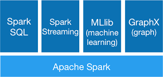

# 😎 What is Spark?

## 👀 Introduction

Apache Spark is a lightning-fast cluster computing technology, designed for fast computation. It is based on Hadoop MapReduce and it extends the MapReduce model to efficiently use it for more types of computations, which includes interactive queries and stream processing. The main feature of Spark is its **in-memory cluster computing** that increases the processing speed of an application.

Spark is designed to cover a wide range of workloads such as batch applications, iterative algorithms, interactive queries and streaming. Apart from supporting all these workload in a respective system, it reduces the management burden of maintaining separate tools.

### Features of Apache Spark

Apache Spark has following features.

* **Speed** − Spark helps to run an application in Hadoop cluster, up to 100 times faster in memory, and 10 times faster when running on disk. This is possible by reducing number of read/write operations to disk. It stores the intermediate processing data in memory.
* **Supports multiple languages** − Spark provides built-in APIs in Java, Scala, or Python. Therefore, you can write applications in different languages. Spark comes up with 80 high-level operators for interactive querying.
* **Advanced Analytics** − Spark not only supports ‘Map’ and ‘reduce’. It also supports SQL queries, Streaming data, Machine learning (ML), and Graph algorithms.

### Spark Built on Hadoop

The following diagram shows three ways of how Spark can be built with Hadoop components.

There are three ways of Spark deployment as explained below.

* **Standalone** − Spark Standalone deployment means Spark occupies the place on top of HDFS(Hadoop Distributed File System) and space is allocated for HDFS, explicitly. Here, Spark and MapReduce will run side by side to cover all spark jobs on cluster.
* **Hadoop Yarn** − Hadoop Yarn deployment means, simply, spark runs on Yarn without any pre-installation or root access required. It helps to integrate Spark into Hadoop ecosystem or Hadoop stack. It allows other components to run on top of stack.
* **Spark in MapReduce (SIMR)** − Spark in MapReduce is used to launch spark job in addition to standalone deployment. With SIMR, user can start Spark and uses its shell without any administrative access.

### Components of Spark

The following illustration depicts the different components of Spark.

### Apache Spark Core

Spark Core is the underlying general execution engine for spark platform that all other functionality is built upon. It provides In-Memory computing and referencing datasets in external storage systems.

### Spark SQL

Spark SQL is a component on top of Spark Core that introduces a new data abstraction called SchemaRDD, which provides support for structured and semi-structured data.

### Spark Streaming

Spark Streaming leverages Spark Core's fast scheduling capability to perform streaming analytics. It ingests data in mini-batches and performs RDD (Resilient Distributed Datasets) transformations on those mini-batches of data.

### MLlib (Machine Learning Library)

MLlib is a distributed machine learning framework above Spark because of the distributed memory-based Spark architecture. It is, according to benchmarks, done by the MLlib developers against the Alternating Least Squares (ALS) implementations. Spark MLlib is nine times as fast as the Hadoop disk-based version of **Apache Mahout** (before Mahout gained a Spark interface).

### GraphX

GraphX is a distributed graph-processing framework on top of Spark. It provides an API for expressing graph computation that can model the user-defined graphs by using Pregel abstraction API. It also provides an optimized runtime for this abstraction.


Read more articles :

* [Tutorialspoint - Apache Spark Introduction](https://www.tutorialspoint.com/apache\_spark/apache\_spark\_introduction.htm)
* [Databricks - Spark And Hadoop](https://databricks.com/blog/2014/01/21/spark-and-hadoop.html)

